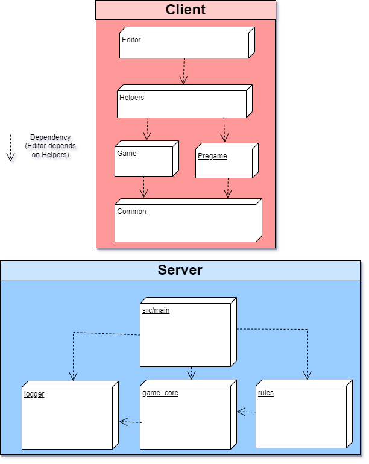
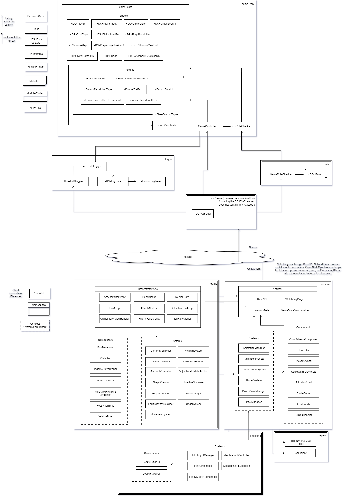

# 🎲 Sintef Digital Board Game 🎲

## Introduction

This is the code repository for the frontend for Sintef Digital Board game. This is a collaboration project with 6 students taking the IT2901 - Informatics Project II course on NTNU.
The frontend consists of an application made in the Unity Engine, which uses C# as scripting language. The game runs in the browser (WebGL) and communicates with the backend's REST API using HTTP requests and responses.

## 🔎 Overview 🔎

The frontend scripts are organized in assemblies in order to speed up compile time and separating unrelated parts of the code.
An assembly that depends on another assembly can access its scripts, but not the other way around.
We have five assemblies: Editor, Helpers, Game, Pregame and Common.

### Editor
Editor scripts have the power to completely change how a MonoBehaviour script appears in the inspector, which is a very useful tool for the developer.
It is important to note that the Editor assembly is outside of the Scripts folder, as this is the default in Unity.

### Helpers
At the start of the project we already had preexisting code for common Unity problems. Rather than building a foundation out of those pre-written packages, we decided to utilize dependency injection.
The Helpers assembly scripts implement interfaces in the other assemblies, removing the dependency in the project core and making the package code easier to replace.
There are currently two interfaces in Common that are implemented in Helpers, namely AnimationManager and PoolManager.
The interfaces are implemented using a package called [TorbuTils](https://github.com/TorbsT/Torbutils), imported using the Unity package manager.

### Game
Game is the largest assembly and contains all scripts related to the actual board game. To be precise, the Game scripts are only running in GameScene.
The scripts heavily rely on GameStateSynchronizer (Common) in order to get updates from backend, but there isn't a "main" script in this assembly.
Game has an extra OrchestratorView namespace to further separate unrelated code.

### Pregame
Pregame scripts run only in IntroScene and MainMenuScene. In other words, they manage everything to do with logging in, creating/joining/finding lobbies, and choosing game options.

### Common
This is the lowest ranking assembly and serves as the core of the frontend application. Common contains scripts that must be accessible to both Pregame and Game.
This includes systems for global color schemes and other quality of life, interfaces for animation and object pooling (implemented by Helpers), and most importantly the Network namespace.
#### Network
All communication between frontend and backend goes through Network's RestAPI class.
Any class can send a request, and receives a callback with either a failure string or success object from backend (the GET and POST methods are generic, they try to deserialize automatically).
RestAPI uses structs and enums defined in NetworkData. NetworkData also tracks the player's name and unique ID when first logging in.
GameStateSynchronizer sends API calls regularly and notifies its listeners when it receives callbacks.
WatchdogPinger is not used anywhere else in the codebase, but it regularly pings the server to verify that the player hasn't lost internet connection.

## 👍 Good to know 👍
- Situation cards are automatically generated based on data received from backend. There is no need to add or change situation cards on frontend.
- The same applies to player objectives (assignments).
- It is possible to make more maps/levels, but it might take some time. You would need to provide a new background, and otherwise place nodes, segments, park&ride spots etc. onto the scene manually.
This comes on top of adding the corresponding map to backend.

## 🖧 Installing and running the client server 🖧

1. Install apache2 on your computer and configure it. On Ubuntu it's recommended to follow [this](https://ubuntu.com/tutorials/install-and-configure-apache#1-overview) tutorial.
2. Clone the repository at a desired location.
3. Change the IP to the back-end-server's IP in the `RestAPI.cs` script. There are preconfigured ScriptableObjects for quickly switching between live server and localhost.
4. Build the project for WebGL. If you are unsure about how to do this, you can follow [this tutorial](https://learn.unity.com/tutorial/creating-and-publishing-webgl-builds#62a05565edbc2a1471677a7b) to step 5.
5. Copy the WebGL build files into the directory you made in step 1 in the tutorial.
6. Start/Restart the apache2 server. You should now be able to play the game in a browser when connecting to the IP of the apache2 server.

## ⚠ Disclaimer about caching ⚠

As the client server runs on WebGL, caching can become an issue as it runs an older snapshot of the game which does not have the latest features. In order to circumvent this problem, a reload requesting all files will be necessary after an update (typically achieved with the CTRL+F5 hotkey in your web browser).

## Need help?

Please let us know and we will try to help if we can.
